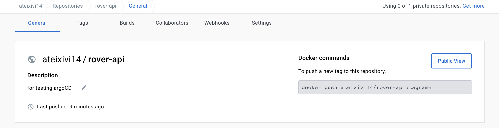
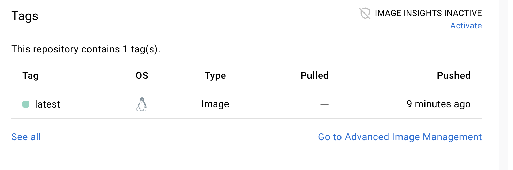
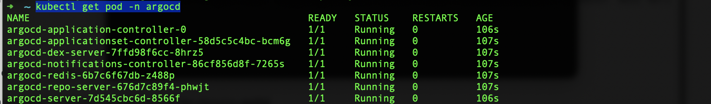
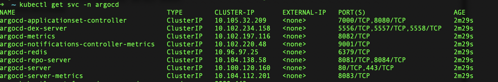
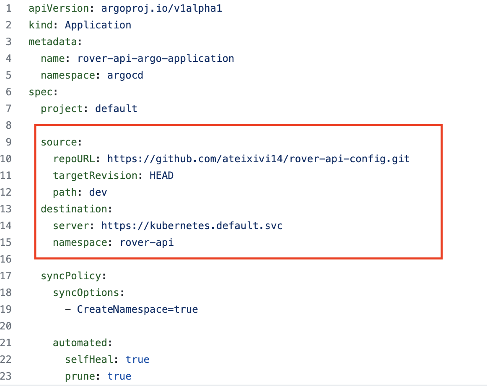
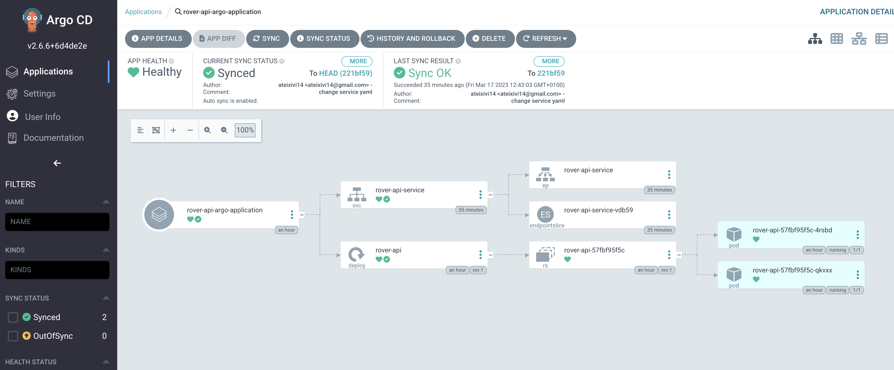

# argocd-tutorial

 ### **1. Having an application image in docker hub**
We need a repository in github which have a DockerFile. In this case, we will use this repository: https://github.com/ateixivi14/rover-api
We need to upload this image to docker hub, for that, after registiring we create a new repository:


We make sure that we have the image in local `docker images`

Then we tag it 

`docker tag rover-api:latest ateixivi14/rover-api` 

And finally we push it:

`docker push ateixivi14/rover-api:latest`


### **2. Install Minikube and set up**

We will need to run these commands if we don't have Minikube installed:
```bash
curl -LO https://storage.googleapis.com/minikube/releases/latest/minikube-darwin-amd64
sudo install minikube-darwin-amd64 /usr/local/bin/minikube
```
And then we start it:

`minikube start`

### **3. Add argoCD to the kubernetes cluster creating the namespace and installing the dependencies:**
```
kubectl create namespace argocd
kubectl apply -n argocd -f https://raw.githubusercontent.com/argoproj/argo-cd/stable/manifests/install.yaml
```
We can check that the pods are running:

`kubectl get pod -n argocd`



### **4. Do port forwarding to enter to argoCD user interface and login it**
We will do port forwarding to `argocd-server `  
To check the service `kubectl get svc -n argocd`



The command for port forwarding: 

`kubectl port-forward svc/argocd-server -n argocd 8080:443`

If we access to `https://localhost:8080` we will see the admin login portal, in which the user is `admin` and the password we can retrieve it with this command:

`kubectl -n argocd get secret argocd-initial-admin-secret -o jsonpath="{.data.password}" | base64 -d`


### **4. Write argoCD config files:**

We need to create a repository that stores the configuration files. In this case, we will use this repository:

https://github.com/ateixivi14/rover-api-config

Note that the argoCD config file is stored in this repository too. In this file, it's important to specify in `source` attribute the git repository in which argoCD will connect to and also the destination or cluster where argoCD will apply the definitions of the config repository.



`targetDivision` attribute means the latest commit in the repository
and the path is the folder that we have the deployment and service files (in config repo) and will be tracked by argoCD

We put the internal service name of kubernetes service. As argoCD is running inside the cluster, we don't need to put external cluster endpoint. 
It applies the config files in the namespace. 

The `syncPolicy` creates the namespace if it's not created.

We configure argoCD to undo any manual change in the cluster, to be sync just with the repository.

argoCD will poll the changes every 3 min in the github repository.

We just need to apply this config just one time. After that, everything should be sincronized.

` kubectl apply -f application.yaml`

We can see finally in the UI the overview of different components of argoCD application, including the two pod replicas:


### References
- https://argo-cd.readthedocs.io/en/stable/operator-manual/declarative-setup/

- https://argo-cd.readthedocs.io/en/stable/getting_started/


